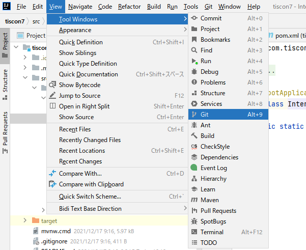
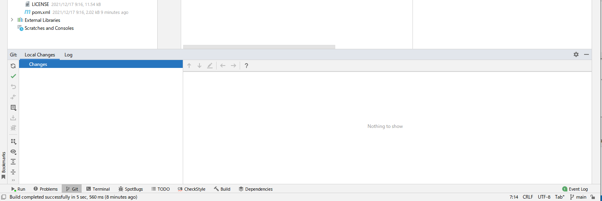
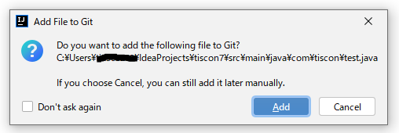
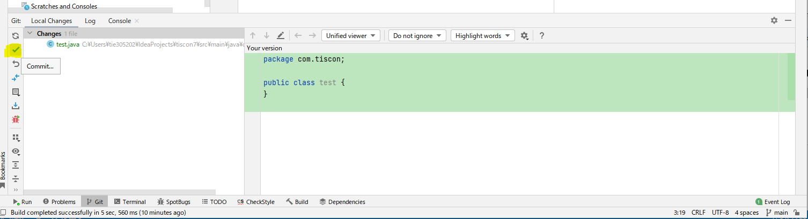
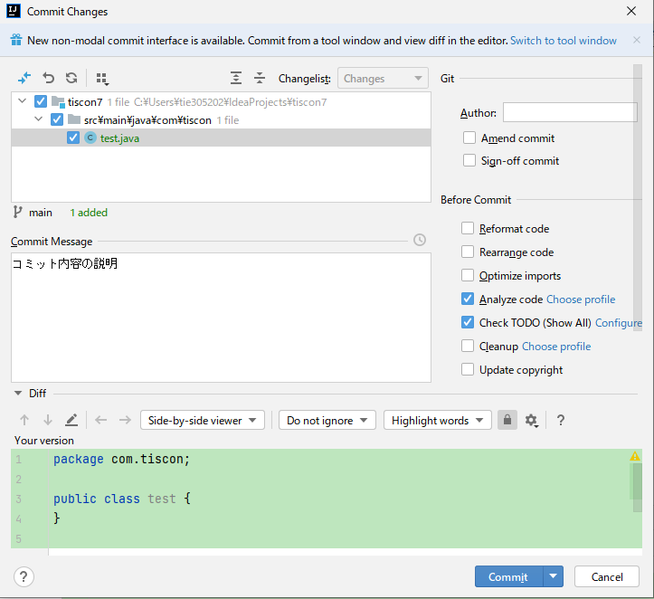
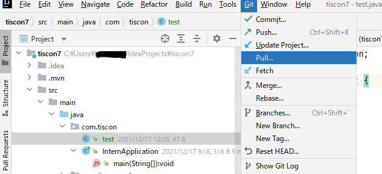
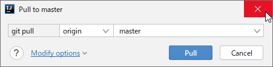
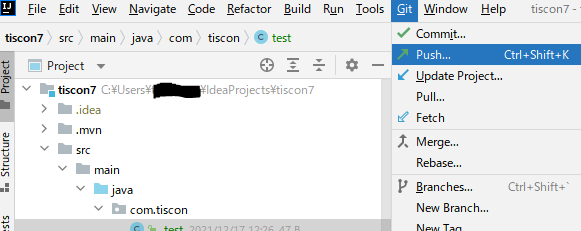
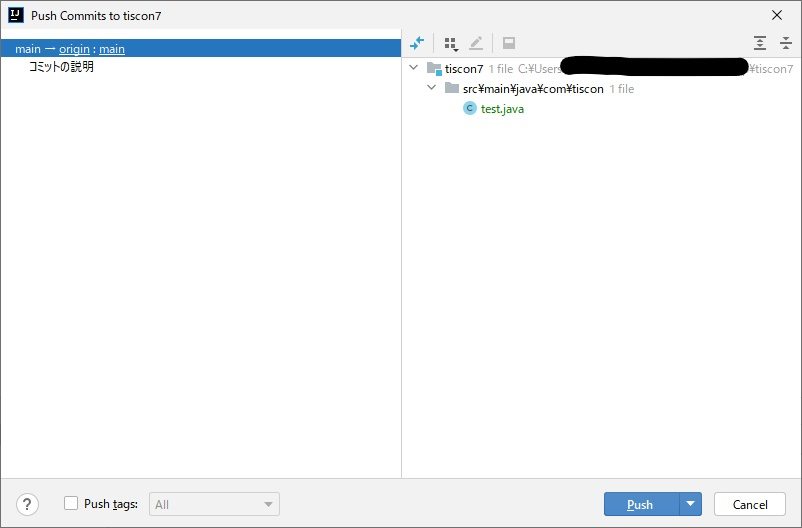
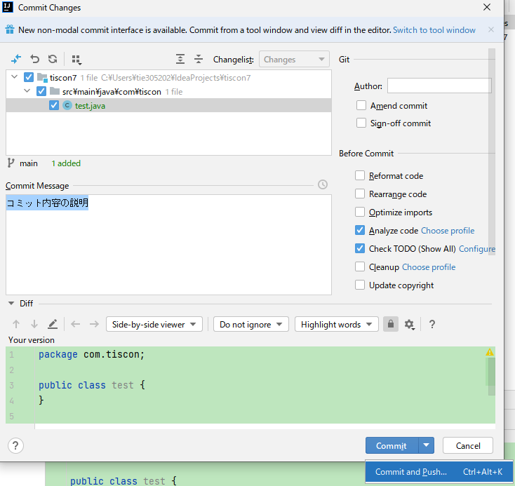

# Gitルーキートラの巻 :tiger:

## Gitとは

ファイルのバージョン管理ツールです。詳しくは以下サイトが非常にわかりやすいです。

* [サルでもわかるGit入門](http://www.backlog.jp/git-guide/)
* [Gitチュートリアル | Atlassian](https://www.atlassian.com/ja/git)

特に[サルでもわかるGit入門](http://www.backlog.jp/git-guide/)は非常に秀逸です。
[Gitの基本](http://www.backlog.jp/git-guide/intro/intro1_1.html)では、Git自体の概要と基本的なキーワードを学べます。
[リポジトリの共有](http://www.backlog.jp/git-guide/intro/intro3_1.html)では、ソースコードの変更をアップロード / ダウンロードする方法が学べます。

ぜひ一読してみてください。
「リポジトリ」「アド」「コミット」「プッシュ」「プル」といわれてなんとなくイメージが湧けばOKです！

## IntelliJでのGitの使い方

以下の記事が参考になります。

* [意外と知らないIntelliJ IDEAのGit管理機能いろいろ（´-`） - Qiita](http://qiita.com/yoppe/items/fd03607d4d4f191d32dd)
* [IntelliJ IDEAでGitとGitHubを使用する方法 - TASK NOTES](http://www.task-notes.com/entry/20160511/1462935600)

特によく使う機能については、以下にまとめておきます。

### Git操作用のタブを開く

IntelliJ上部メニューバーから、`View > Tool Windows > Git` を選択します。

`Git` タブが開きます。今後Gitの操作では頻繁にこのタブを使います。

### 変更内容をコミット([Commit](https://backlog.com/ja/git-tutorial/intro/03/))する

[Commit](https://backlog.com/ja/git-tutorial/reference/basic/#section3) は、現在の作業状態を将来見直せる形でセーブしたい時に使います。つまりコーヒーを買いに行く時には使いませんが、帰宅する前やタスクが終わった時には使います。

#### 新規に追加したファイルをGitの管理対象に追加する

IntelliJでファイルを新規作成すると、作成時に

と尋ねられるので、「Add」と答えておいてください。これでファイルが [add](https://backlog.com/ja/git-tutorial/reference/basic/#section2) されます。

#### [Commit](https://backlog.com/ja/git-tutorial/intro/03/) する

[Commit](https://backlog.com/ja/git-tutorial/intro/03/) したくなったら、 `git` タブの `Default Changelist` 内のリストを見てみてください。変更したいものがすべてこの内部に入っていれば準備OKです。

そして `Git` タブの `Commit` ボタンをクリックして、

コミット画面を開きます。

コミットの内容が分かるようなメッセージを **必ず** 書いて、 `Commit` ボタンをクリックすればコミット完了です。

### リモートリポジトリの内容をダウンロード(Pull)する

[Pull](https://backlog.com/ja/git-tutorial/intro/11/) は、他のチームメンバーが書いてくれたコードを自分のPCにダウンロードする時に使います。

IntelliJで  `Git` > `Pull` をクリック。

[Pull](https://backlog.com/ja/git-tutorial/intro/11/) のオプションを選ぶ画面が表示されるので、

自分が更新をダウンロードしたいリモートリポジトリ`origin`、ブランチ（ブランチを特に作成していなければ`master`）を選択して `Pull` をクリック。

### ローカルリポジトリの内容をアップロード(Push)する

[Push](https://backlog.com/ja/git-tutorial/intro/09/) は、自分のPCの[Commit](https://backlog.com/ja/git-tutorial/intro/03/)内容を他のチームメンバーに共有したい時に使います。コミットされていない内容はアップロードできないので、まだ[Commit](https://backlog.com/ja/git-tutorial/intro/03/)していない人はまず[Commit](https://backlog.com/ja/git-tutorial/intro/03/)しましょう。

`Git` > `Push` をクリックして[Push](https://www.atlassian.com/ja/git/tutorials/syncing/git-push)画面を開きます。

自分が[Commit](https://backlog.com/ja/git-tutorial/intro/03/)した内容が表示されるので、思ったとおりの内容なら `Push` をクリック。

これで [Push](https://backlog.com/ja/git-tutorial/intro/09/) は完了です。

ちなみに、[Commit](https://backlog.com/ja/git-tutorial/intro/03/)内容を即[Push](https://backlog.com/ja/git-tutorial/intro/09/)してしまいたければ、[Commit](https://www.atlassian.com/ja/git/tutorials/saving-changes/git-commit)時に `Commit and Push` を選択すればできます。

