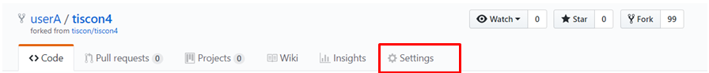
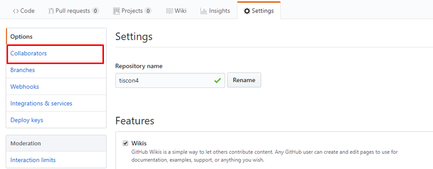
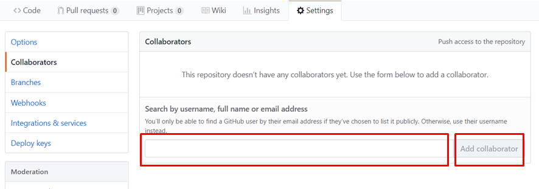

# チーム開発手引き

※この資料は事前準備の段階で読む必要はありません！ 

チームで仕事をしていると、作業分担をしたくなります。その時は以下の手順で作業を分担し、それを集めることができるようになります。

## 代表がチーム用のリポジトリを最新化する。
代表者は自分のリポジトリ`（https://github.com/[Githubのユーザ名]/tiscon7）`を[リポジトリ更新手引き](gitUpdateGuide.md)を参考にアップデートをしてください。苦戦することの多い箇所ですので、難しそうであれば早めにスタッフを呼んでください。

## 代表のリポジトリにチームメンバーを招待する
代表のリポジトリのユーザーは自分のリポジトリ`（https://github.com/[Githubのユーザ名]/tiscon7）`にアクセスして、 `Settings` タブをクリックしてください。

表示された画面で `Collaborators` タブをクリックします。

パスワードを再入力するよう言われるので入力すると、リポジトリの参加者を追加できます。チームメンバーのGitHubアカウント名を入力して追加しましょう。

チームメンバーには、登録したメールアドレス宛にリポジトリへの招待メールが来ます。 `Approve` (承認)すると、今後代表のリポジトリに作業内容をアップロードできるようになります。

※メールが見られない場合 
https://github.com/(代表者のユーザ名)/tiscon7/invitations 
にアクセスすることで招待メールにある承認ボタンを押したことと同じになります。 

## 代表のリポジトリをcloneする
チームメンバーは、事前準備でtiscon7をcloneし動作確認を行った時の手順([Windows、Mac共通](operationCheck.md))を参考に、代表のリポジトリをcloneしましょう。 
cloneするときに指定するURLを、代表者がforkしたリポジトリのURLにするのを忘れないようにしましょう。 
これで、代表のリポジトリをチームメンバー全員で共有できました。今後あなたがアップロードした内容は他のチームメンバーにも共有されます。

## 作業内容をアップロードする
作業内容をアップロードしたくなったら以下の手順でできます。

1. [変更内容をコミット(Commit)する | Gitルーキートラの巻 :tiger:](gitForRookies.md#変更内容をコミットcommitする)を参考に、作業内容を保存します。 
1. [リモートリポジトリの内容をダウンロード(Pull)する | Gitルーキートラの巻 :tiger:](gitForRookies.md#リモートリポジトリの内容をダウンロード(Pull)する)を参考に、他のチームメンバーが自分より先にアップロードした内容をダウンロードします。ここで自分の作業内容と競合した時は、すでにアップロードされている内容を尊重しながら競合を解決してください。ただしここは難しいので、スタッフを呼んでもかまいません。 
1. [ローカルリポジトリの内容をアップロード(Push)する | Gitルーキートラの巻 :tiger:](gitForRookies.md#ローカルリポジトリの内容をアップロード(Push)する)を参考に、作業内容をアップロードします。 
