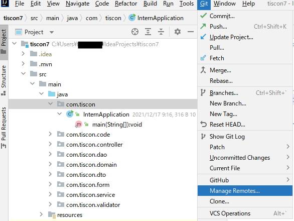
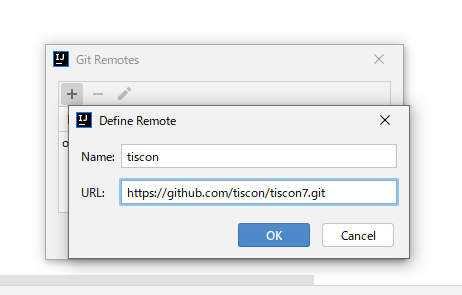

# リポジトリ更新手引き

※この資料は事前準備の段階で読む必要はありません！ 

***
* [本家リポジトリの更新を自分のリポジトリに取り込みたい](#本家リポジトリの更新を自分のリポジトリに取り込みたい)
* [チームメンバーのリポジトリの更新を自分のリポジトリに取り込みたい](#チームメンバーのリポジトリの更新を自分のリポジトリに取り込みたい)
***

## 本家リポジトリの更新を自分のリポジトリに取り込みたい

fork元の本家リポジトリ( https://github.com/tiscon/tiscon7) に更新があった時、それを自分のリポジトリに取り込む手順です。

### 前提条件

[Gitルーキートラの巻](gitForRookies.md)を一読してある、もしくは内容が分かること。

### 本家リポジトリを参照できるようにする( `git remote add` )

https://github.com/tiscon/tiscon7.git を tiscon という名前でリモートリポジトリに追加します。

IntelliJで `Git` > `Manage Remotes...` をクリック。

Git Remotes の[+]マークをクリックすると、Define Remoteが表示されるので、
nameに `tiscon` 、 URLに `https://github.com/tiscon/tiscon7.git` と入力してOKをクリック。

### 本家リポジトリの変更を取り込む

tisconのmasterブランチをローカルのmasterブランチにダウンロードします。

[リモートリポジトリの内容をダウンロード(Pull)する | Gitルーキートラの巻 :tiger:](gitForRookies.md#リモートリポジトリの内容をダウンロード(Pull)する)と同様の手順でダウンロードしてください。

### 自分のリポジトリに変更をアップロードする

[ローカルリポジトリの内容をアップロード(Push)する | Gitルーキートラの巻 :tiger:](gitForRookies.md#ローカルリポジトリの内容をアップロード(Push)する)と同様の手順で、originリポジトリに変更をPushしてください。

## チームメンバーのリポジトリの更新を自分のリポジトリに取り込みたい
1. [本家リポジトリを参照できるようにする( `git remote add` )](#本家リポジトリを参照できるようにする-git-remote-add-) と同じ手順で、更新を取り込みたいチームメンバーのリポジトリを参照できるようにします。その時、登録するURLは `https://github.com/更新を取り込みたいチームメンバーのGitHubアカウント名/tiscon7.git` で、その時の登録名はそのメンバーのGitHubアカウント名にしましょう。
1. [リモートリポジトリの内容をダウンロード(Pull)する | Gitルーキートラの巻 :tiger:](gitForRookies.md#リモートリポジトリの内容をダウンロード(Pull)する)と同様の手順でダウンロードしてください。その時、ダウンロード元のリモートリポジトリは、更新を取り込みたいチームメンバーのものを選択してください。
1. [ローカルリポジトリの内容をアップロード(Push)する | Gitルーキートラの巻 :tiger:](gitForRookies.md#ローカルリポジトリの内容をアップロード(Push)する)と同様の手順で、originリポジトリに変更をPushしてください。
