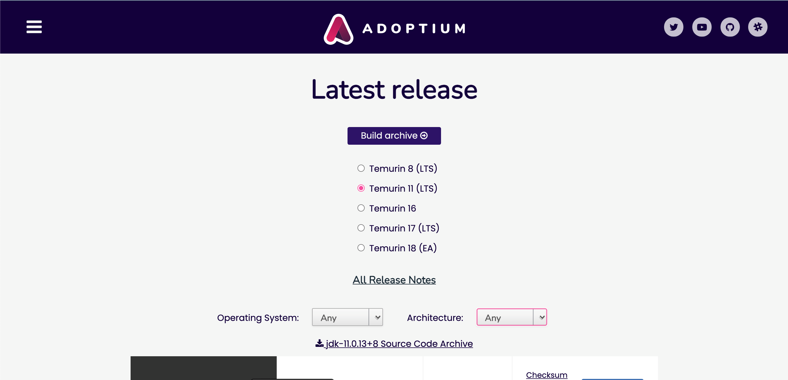
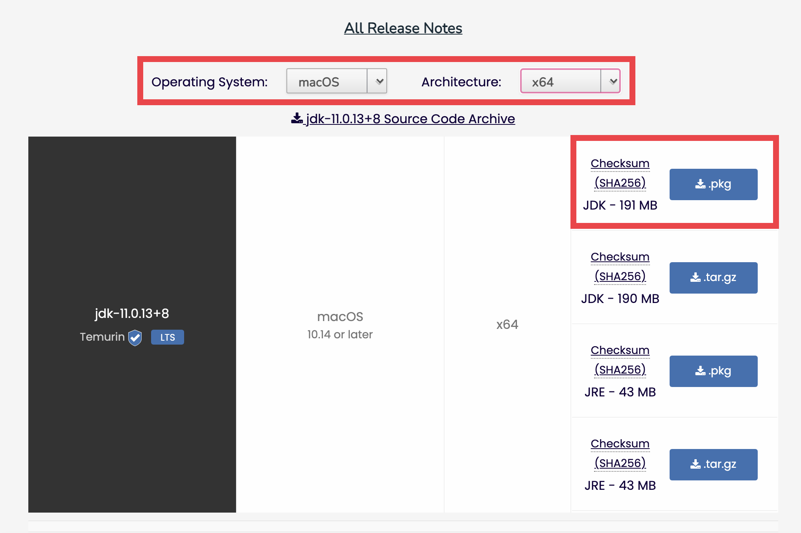
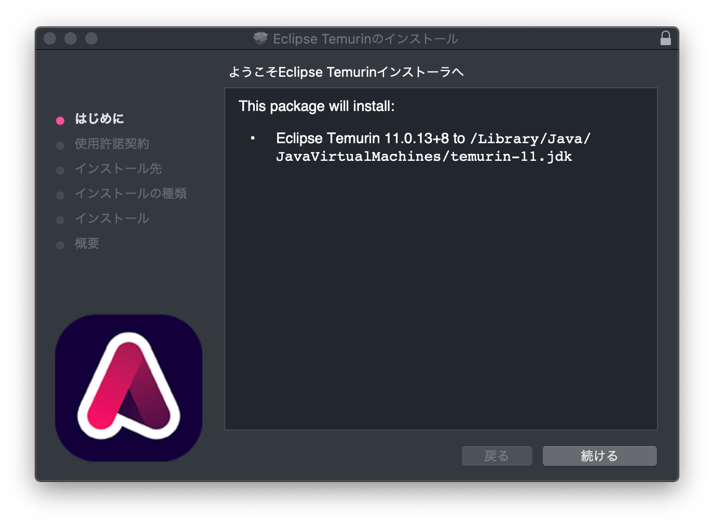
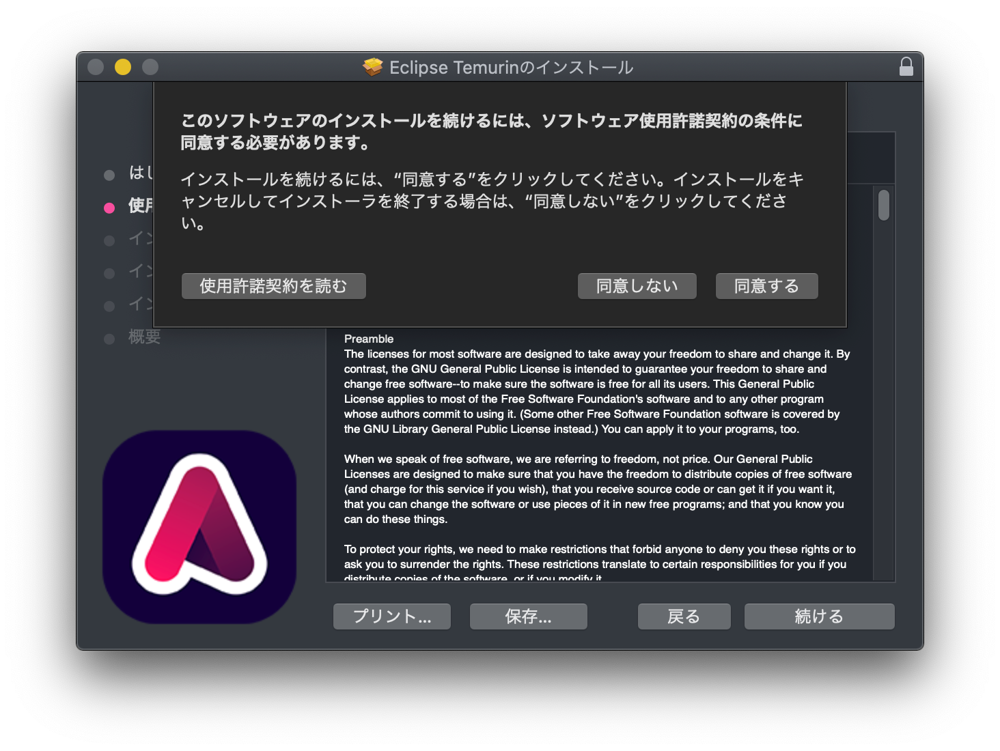
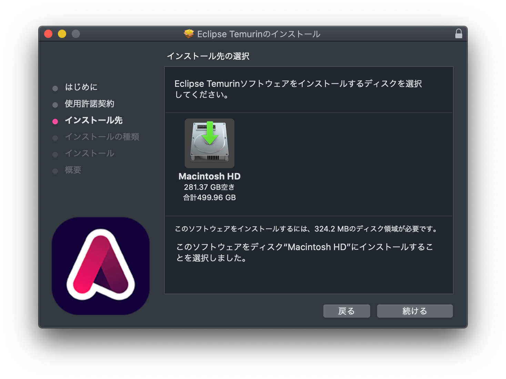
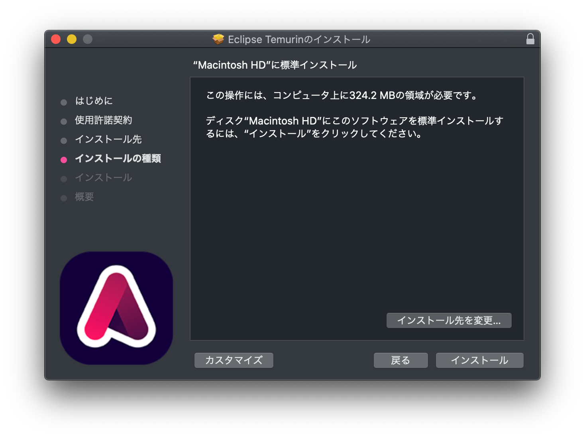
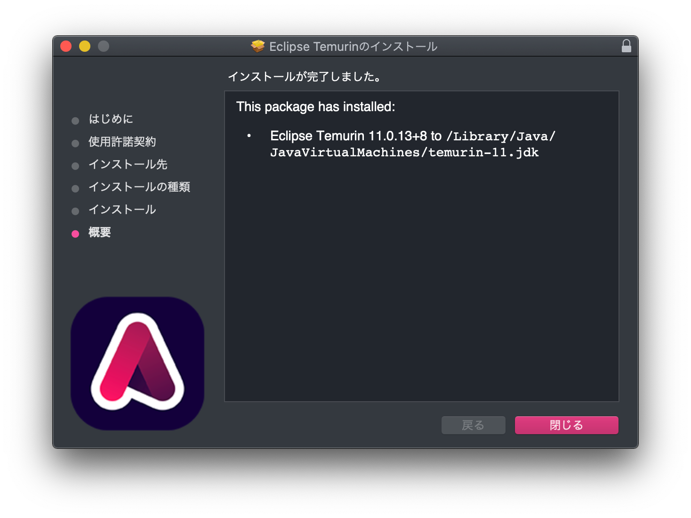

# Javaのインストール(Mac)

## 前提条件

なし


**JDK11のインストール**及び**環境変数の設定**を行います。

### 1. JDK11をダウンロード

以下のサイトにアクセスして、AdoptOpenJDKのJDK11をダウンロードしましょう。

[AdoptOpenJDK11](https://adoptium.net/releases.html?variant=openjdk11)

サイトを開くと以下のような画面が開きます。




画像のように、「Operating System」はMacOSを、「Architecture」には「x64」を選択した上で、「JDK」とかいてある.pkg形式でダウンロードできるリンクをクリックします。



なお、2021/12/01現在はOpenJDK 11の最新版は**11.0.13+8**となっているため、以降の手順はこのversionで進めます。
ダウンロード時にさらに新しいversionのものが選択される可能性がありますが、その場合はそのversionで進めて構いません。

### 2. JDKをPCにインストールする。
ダウンロードしてきたファイルをダブルクリックで実行してください。
実行すると以下のような画面が開きます。



「同意する」をクリック。  


特に設定は変更せず、[続ける]をクリックしていきます。  


[インストール]をクリックするとインストールが開始します。  


[完了]を押して終了です。  



## インストールできたら

[Terminalを起動](tipsForMac.md#terminalの起動方法) して
```sh
> java -version
openjdk version "11.0.13" 2021-10-19
OpenJDK Runtime Environment Temurin-11.0.13+8 (build 11.0.13+8)
OpenJDK 64-Bit Server VM Temurin-11.0.13+8 (build 11.0.13+8, mixed mode)
```
というように `java` コマンドが動くことが確認できればOKです。

またこの時、`java -version`で表示されたバージョンが、自分がインストールしたJavaのバージョンと一致していることを確認してください。
