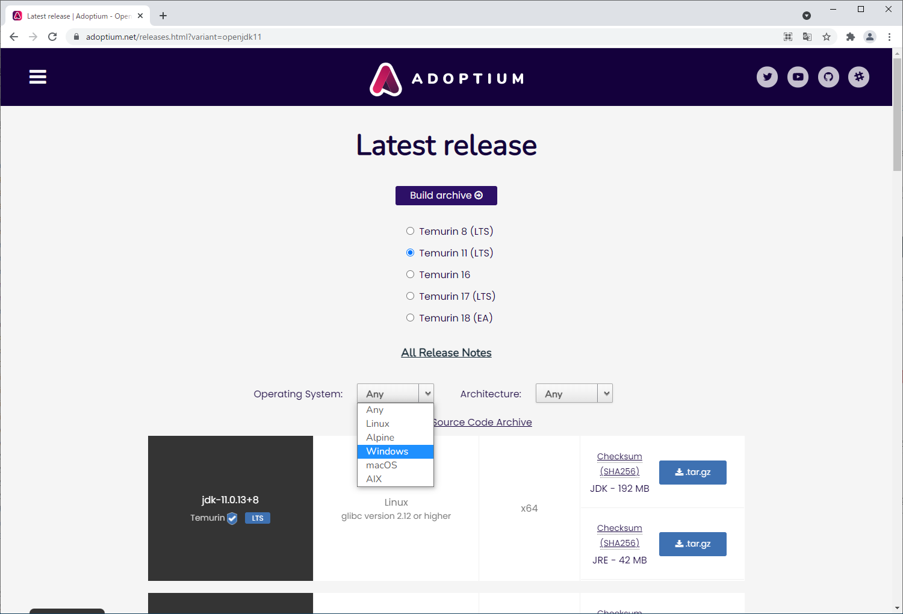
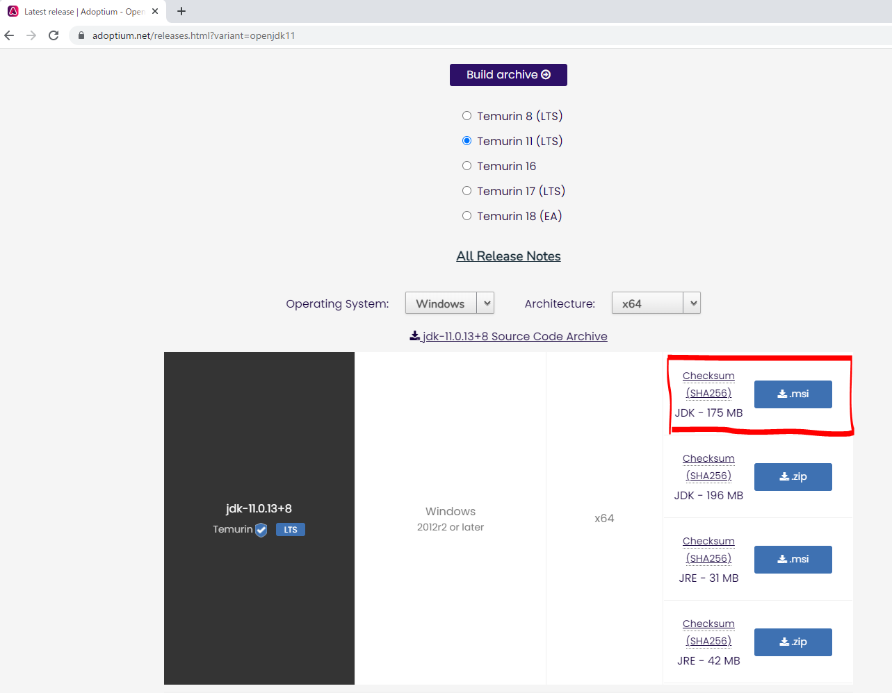
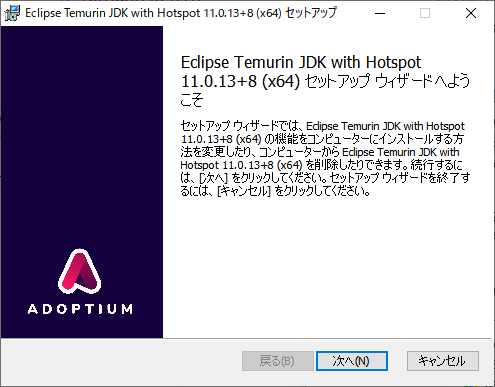
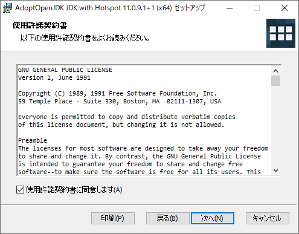
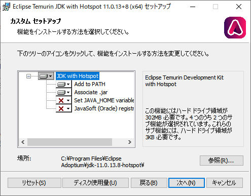
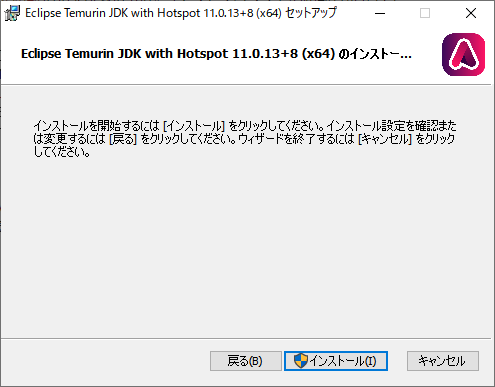
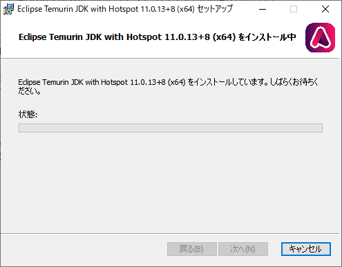

# Javaのインストール(Windows)

## 前提条件

* [自分のPCのOSが何bitか知っていますか？](preparationForWin.md#自分のpcのbit数を知っておく)
* [ファイルの拡張子が表示されていますか？](preparationForWin.md#ファイルの拡張子表示)

## インストール

**JDK11のインストール**及び**環境変数の設定**を行います。

> **注意点**
> * コマンドプロンプトの開き方が分からない方は、[コマンドプロンプトの起動方法 | Windowsマシンの開発TIPS](tipsForWin.md#コマンドプロンプトの起動方法)を読んでみてください。

### 1. JDK11をダウンロード

以下のサイトにアクセスして、AdoptOpenJDKのJDK11をダウンロードしましょう。

[AdoptOpenJDK11](https://adoptium.net/releases.html?variant=openjdk11)

サイトを開くと以下のような画面が開きます。
画像のように、「Operating System」はWindowsを選択します。



「Architecture」はお使いのPCがWindows 32bitであれば「x86」、Windows 64bitであれば「x64」を選択してください。


赤枠のように「JDK」とかいてあり、msi形式でダウンロードできるリンクをクリックします。



なお、2021/12/01現在はOpenJDK 11の最新版は**11.0.13+8**となっているため、以降の手順はこのversionで進めます。
ダウンロード時にさらに新しいversionのものが選択される可能性がありますが、その場合はそのversionで進めて構いません。

### 2. JDKをPCにインストールする。
ダウンロードしてきたファイルをダブルクリックで実行してください。
実行すると以下のような画面が開きます。



「使用許諾契約書に同意します(A)」にチェックをいれる。  


特に設定は変更せず、[次へ]をクリックしていきます。  


[インストール]をクリックするとインストールが開始します。  


インストールが完了するのを待ちます。  


[完了]を押して終了です。  


## インストールできたら

[コマンドプロンプトを起動](tipsForWin.md#コマンドプロンプトの起動方法)して、

```sh
(Windows が 64bitの場合)
C:\Users\yourUserName> java -version
openjdk version "11.0.13" 2021-10-19
OpenJDK Runtime Environment Temurin-11.0.13+8 (build 11.0.13+8)
OpenJDK 64-Bit Server VM Temurin-11.0.13+8 (build 11.0.13+8, mixed mode)
```
というように `java` コマンドが動くことが確認できればOKです。

またこの時、`java -version`で表示されたバージョンが、自分がインストールしたJavaのバージョンと一致していることを確認してください。
