# 動作確認

## 前提条件(Windows)

* [コマンドプロンプトを起動](tipsForWin.md#コマンドプロンプトの起動方法)して `java -version` とコマンドを入力した時、結果が返ってきますか？
* [コマンドプロンプトを起動](tipsForWin.md#コマンドプロンプトの起動方法)して `git --version` とコマンドを入力した時、結果が返ってきますか？

## 前提条件(Mac)

* [Terminalを起動](tipsForMac.md#terminalの起動方法)して `java -version` とコマンドを入力した時、結果が返ってきますか？
* [Terminalを起動](tipsForMac.md#terminalの起動方法)して `git --version` とコマンドを入力した時、結果が返ってきますか？

## 手順
1. IntelliJの実行
2. IntelliJでプロジェクトをcloneする
3. ソースコード確認
4. Gitの設定
5. SDKの設定
6. Webアプリケーションの起動確認

### 1. IntelliJの実行

インストールするとデスクトップにショートカットが作成されますので起動してください。<br>
ショートカットが無い場合、スタートメニューのプログラム一覧から起動してください。<br>
 `JetBrains` > `IntelliJ IDEA Community Edition`

起動中は下記のような画面が表示されます。<br>


起動が完了すると下記のような画面が表示されます。<br>
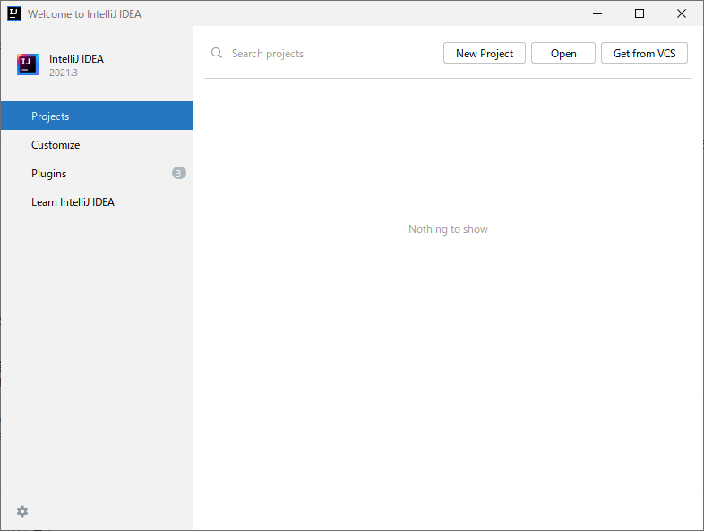

### 2. IntelliJでプロジェクトをcloneする

1.  `Get from VCS` を選択します。
1. URLに `https://github.com/tiscon/tiscon7.git` を入力します。<br>
Directoryには自動で`C:\Users\[ユーザ名]\IdeaProjects\tiscon7`が設定されます。<br>
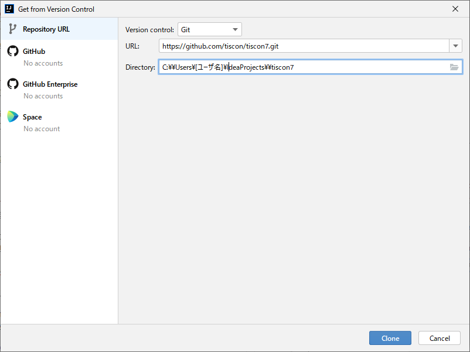
1. Cloneボタンを押下します。
1. 画面にステータスが表示されます。バーの表示が消えればcloneは完了です。<br>
 
 #### (閉じてしまったプロジェクトを開く方法)
1. IntellijのWelcome画面の Open を選択します。<br>
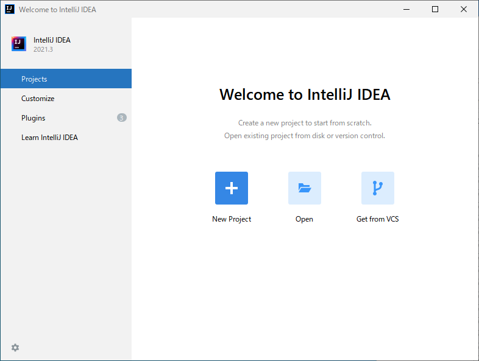

1. `C:\Users\ユーザ名\IdeaProjects\tiscon7` を選択し、OKを押します。<br>
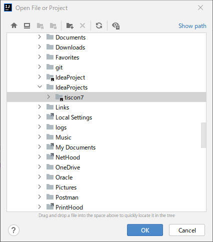

1. tiscon7プロジェクトが開けました。<br>
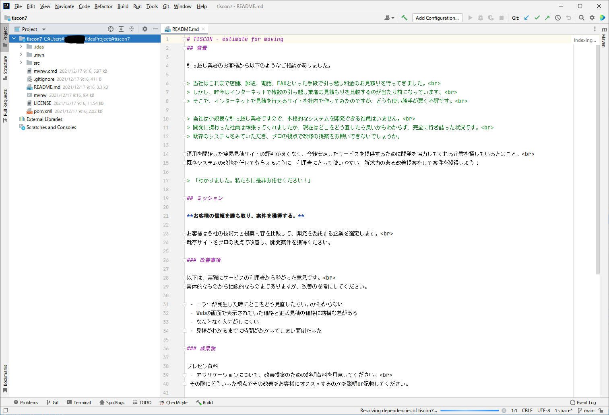

### 3. ソースコード確認

1. IntelliJ上部メニューバーから、`View > Tool Windows > Project` を選択します。<br>
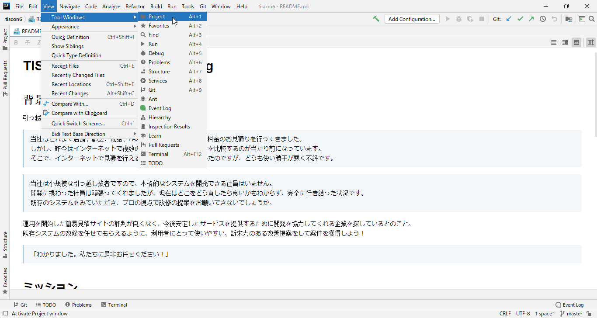

1. Project Viewよりプロジェクト内のソースコードが確認できるようになりました。<br>
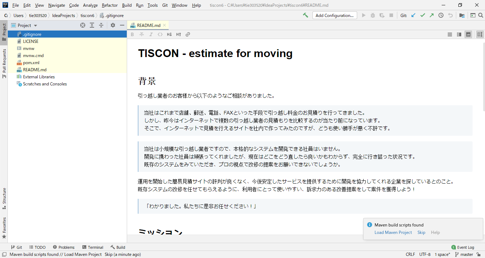

1. 以下のようにpom.xmlに「m」というマークがついていない場合以下の手順4.と5.を実行してください。<br>  
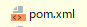

1. [pom.xml]で右クリックをし、[＋ Add as Maven Project]をクリックしてください。<br>


1. pom.xmlに「m」というマークがつきました。<br>
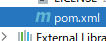

### 4. [Git](https://git-scm.com/)の設定

今後の作業内容をあなたのGitHubアカウントに紐付けられるようにします。

1. IntelliJ上部メニューバーから、`View > Tool Windows > Terminal` を選択します。<br>
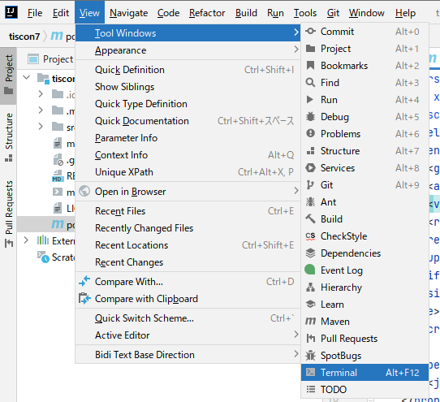

1. 画面下部にTerminal画面が表示されるので、以下を入力してください。<br>
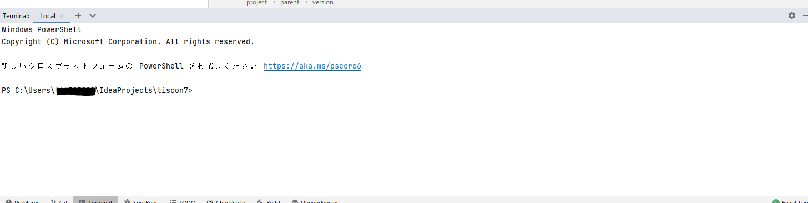

```sh
git config user.name GitHubのユーザ名
git config user.email GitHubのメールアドレス
```
コマンド実行後、何もエラーメッセージが表示されなければ設定完了です。

## 5. SDKの設定

1. IntelliJ上部メニューバーから、 `File` > `Project Structure...` を選択します。<br>
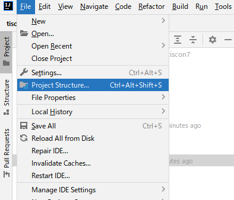

1. [Project SDK]という見出しの下にあるプルダウンが＜No SDK＞になっていると思いますので、【Add SDK】→【JDK】を選択してください。<br>
なお、＜No SDK＞とある箇所のプルダウンにすでに【11(java version "11.0.9")】がある場合はそれを選択してください。
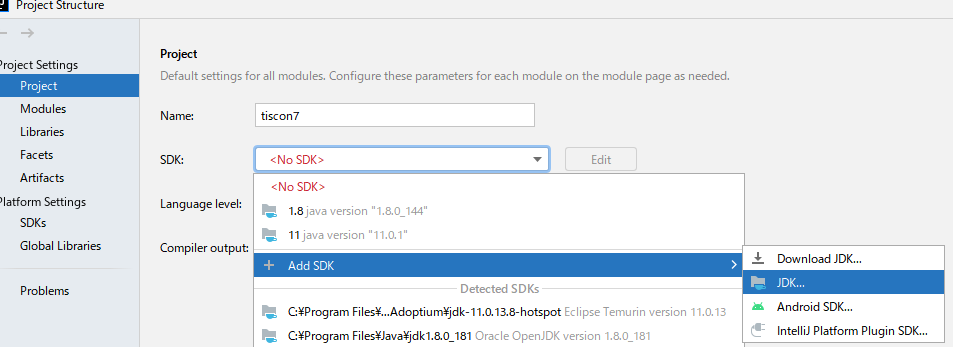

1. （【temurin-11】を選択した場合はこの手順は不要です。）
ご自身がインストールしたjdkの場所(C:\Program Files\AdoptOpenJDK\jdk-11.0.13.8-hotspot)を選択して[OK]を押下してください。<br>
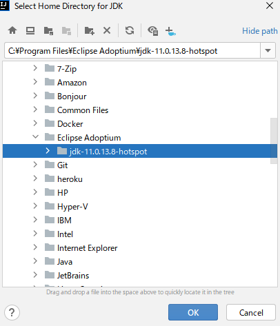

1. Project SDKが設定され、【temurin-11】が選択されるかと思います。
一つ下の項目「Project language level」は「SDK default」を選択してください。<br>
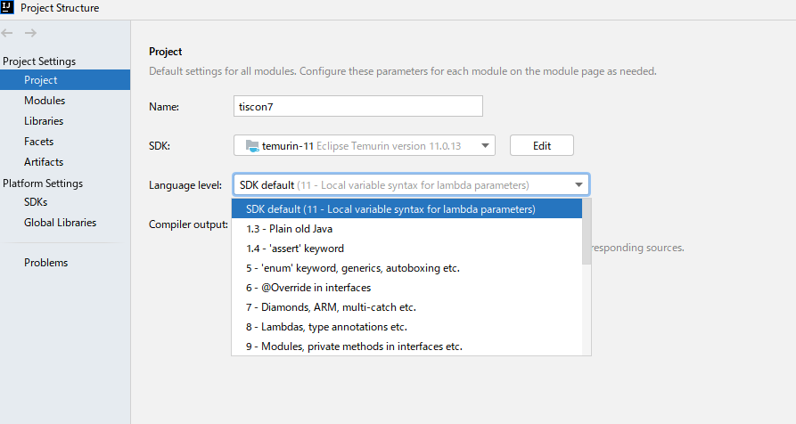

1. [Project SDK]と[Project language level]の設定が完了したら、『OK』を選択してください。<br>


### 6. Webアプリケーションの起動確認

cloneしたWebアプリケーションが正常に動くか、開発ローカル(自PC)上で動作確認を行います。

##### 1. アプリケーションを起動前に準備する

Mavenコマンドを実行するため、下図のように `View > Tool Windows > Maven` を選択して、ダイアログを開き、以下のコマンドを実行します。
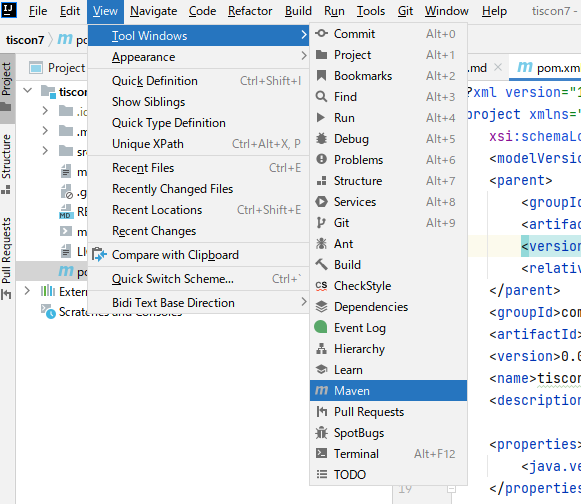

開いたMavenメニューより青色四角内の[m]マークを選択して、ダイアログを開きます。
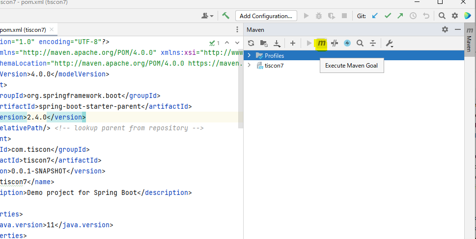

ダイアログが表示できました。
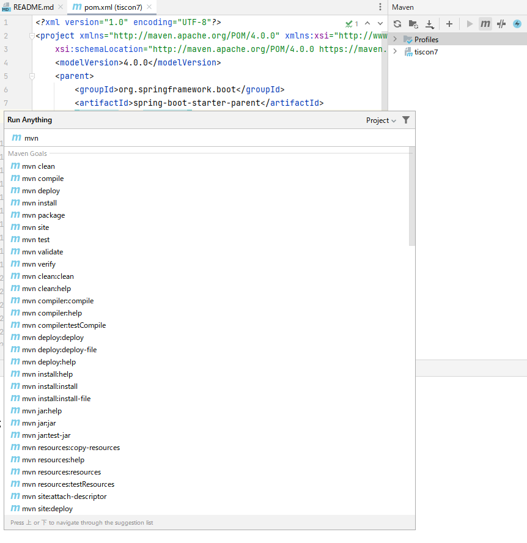

開いたダイアログに下記コマンドを入力します。<br/>
```text
mvn clean compile
```
  
この時に元々ダイアログに書かれていた `mvn` は消さないよう注意してください。<br/>
最後にEnterキーを押しコマンドを実行します。
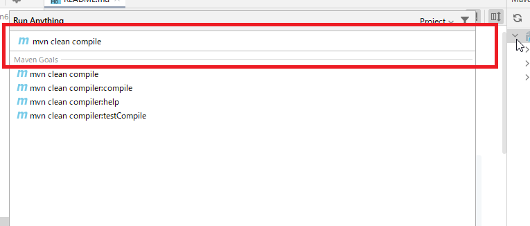

実行して、下記のように「BUILD SUCCESS」と表示されれば成功です。<br/>
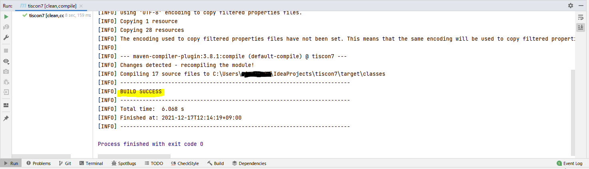

##### 2. アプリケーションを起動する
 `src/main/java/com.tiscon/InternApplication` の上で右クリックをし、 `▶ Run 'InternApplicat....main()'`をクリックしてください。

 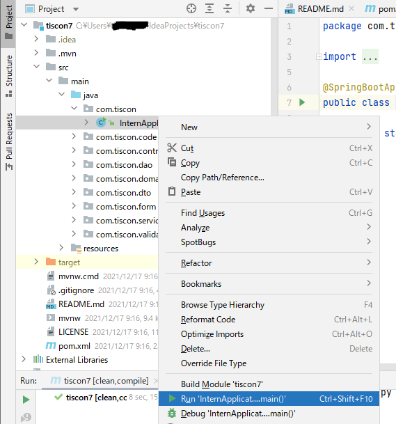

 なお、初回起動時にはWindowsセキュリティの警告がされる場合がありますが、[アクセスを許可する]をクリックしてください。

 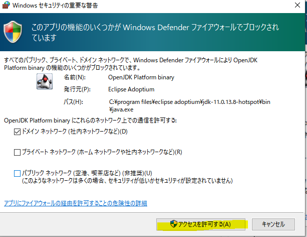

##### 3. ブラウザで画面表示を確認する
以下のURLをクリックし、ブラウザを開いて画面が表示されることを確認します。

http://localhost:9080/

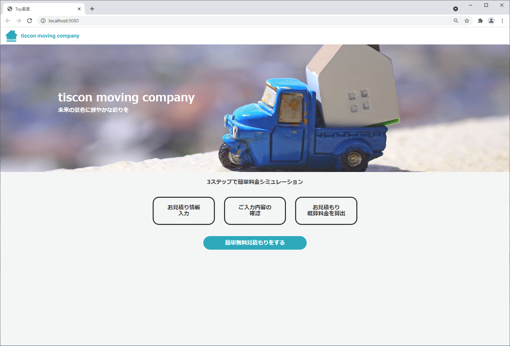

##### 4. アプリケーションを終了する
動作が確認できたらアプリケーションを終了しましょう。<br>
Runの`internApplication`のタブを開いた状態で左の停止(赤四角)ボタンを押します。

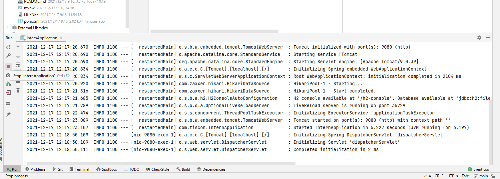

#### お疲れ様でした！
