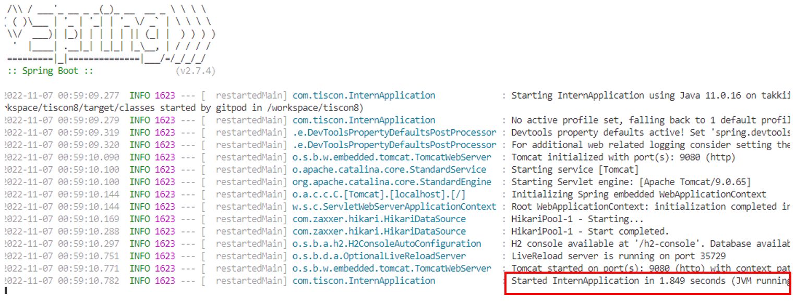

# 動作確認

## 手順

本手順において、画面キャプチャ内の「tiscon8-pre」は「tiscon8」に読み替えてください。

1. [GitHubリポジトリのFork](#1githubリポジトリのfork)
1. [Gitpodのログイン](#2gitpodのログイン)
1. [Workspaceの作成](#3workspaceの作成)
1. [Webアプリケーションの起動確認](#4webアプリケーションの起動確認)
1. [Webアプリケーションの終了](#5webアプリケーションの終了)

### 1.GitHubリポジトリのFork

1. 以下を押下し、インターンシップ向けアプリにアクセスして下さい。  
   1. https://github.com/tiscon/tiscon8
1. GitHubの画面右上 `Fork` ボタンを押下します。  

1. `Create Fork` を押下します。画面が切り替わります。  

1. 画面左上で [自分のGitHubユーザ名]/tiscon8 となっていればOKです。  

1. `Code` を押下します。  

1. 図のクリックボードアイコンを押下し、URLをコピーします。  

### 2.Gitpodのログイン

1. 以下にアクセスし、 `Continue with GitHub` を押下します。
   1. https://gitpod.io/login  

1. GitHubへのログインやアクセス権の付与を求められた場合は、従ってください。

1. エディターの選択画面が出るので、 `continue` を押下します。

### 3.Workspaceの作成

1. 「Workspaces」画面に遷移します。 
1. `New Workspace` を押下し、手順1-6 でコピーしたURLを入力し、選択します。  

1. 電話番号の入力を求められます。インターンシップ当日に利用可能な電話番号を入力し、`Send Code via SMS` を押下します。

1. 届いたSMSに記載されている認証コードを入力し、 `Validate Account` を押下します。
1. 以下のような画面となったら、 `continue` を押下します。  

1. 起動が完了するまで1,2分程度待ちます。  

1. このような画面が出たらOKです。プロジェクト内のソースコードが確認できるようになりました。  

### 4.Webアプリケーションの起動確認

1. 画面下部のTerminal画面に `Started InternApplication` と表示されていることを確認します。異なる表示がされている場合は、次の手順に進んでください。

   1. 以下のように `ZipException` と表示されている場合は以下手順に従ってください。異なる表示がされている場合は、問い合わせ手順に従ってご連絡ください。

   1.  Terminalの一番下に `./mvnw spring-boot:run` と入力し、Enterキーを押下します。

   1. 画面下部のTerminal画面に `Started InternApplication` と表示されていればOKです。
1. 画面右下 `Open Browser` を押下し、ブラウザを開いて画面が表示されることを確認します。  

1. 通知が消えてしまっている場合は、右下のベルマークを押下すると再度表示されます。  

1. 以下のような画面が立ち上がったらOKです。  

### 5.Webアプリケーションの終了

動作が確認できたらアプリケーションを終了しましょう。  

1. Gitpod画面左下の `Gitpod` を押下します。  

1. 画面上部に表示された `Gitpod: Stop Workspace` を押下します。  

1. Workspaceの停止を知らせる画面が表示されればOKです。  

### もう一度起動したい場合

`Go To Dashbord` を押下すると、Workspace一覧が表示されます。  
対象のWorkspace右の `縦三点リーダー > Open` から起動できます。

ただし、Workspace作成後２週間経過すると自動的に削除されてしまいます。  
その場合は、手順3「Workspaceの作成」を再度実施していただくことで、再度確認できます。

__※Workspaceの起動時間には50h/monthの制限があります。__  
__インターンシップ当日に利用できるよう、ご注意ください。__

「何時間くらい使ったの？」と気になる方は、 `画面右上のアカウントアイコン > Settings > Plans` から残り利用可能時間が確認できます。

__お疲れ様でした！次は事前学習へ進んでください。__
