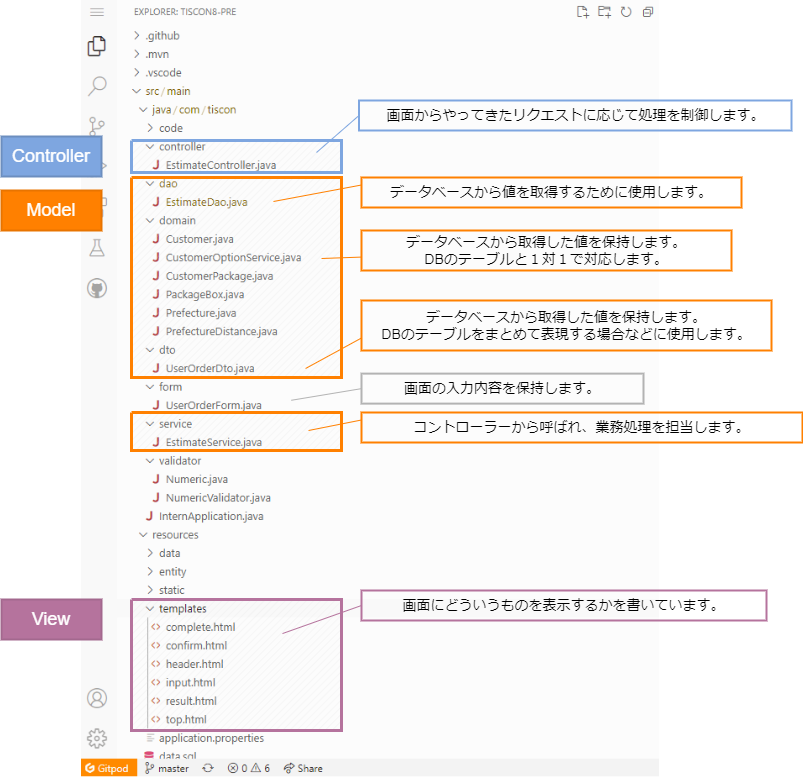

# Webアプリケーションの概要

tiscon7のアプリケーションについて、おおまかな処理の流れを説明します。 
どこにどのようなプログラムファイル（ソースコード）があるのかについて、最も重要な範囲を説明します。 
実際にプログラムを参照したり、変更していくためにイメージを掴んでおきましょう。 

## 全体像

以下はWebアプリケーションの概念図です。 

ソースコードを参照するにあたって、各プログラムの役割を知っておきましょう。 

## Webアプリケーションの処理フロー

シンプルな例として、赤点線内で完結する処理の流れを追ってみましょう。 

### ① リクエスト

ボタンのクリックなど、Webブラウザを操作することでサーバへ要求が送られます。 
この要求をリクエストと呼びます。 

### ② Controllerの呼び出し

Frameworkはルールに従って、そのリクエストを処理するControllerを呼び出します。 

### ③ Viewを呼び出し、HTMLを作る

Controller（Actionクラス）は、ModelやViewなどの必要な処理の呼び出しを制御します。 
今回の例では画面表示を担うViewの呼び出しのみを行います。（必要があれば、Viewを呼ぶ前にModelを呼び出します。） 

 
ViewはHTMLを作成します。 
画面はユーザ操作によって内容が変わるのが普通なので、受け取った値を使ってHTMLを作成します。 

### ④ レスポンス

HTMLができたらFrameworkが受け取り、ユーザへ結果を返します。 

 

以上がWebアプリケーションのベースとなる処理の流れです。 

どのようなプログラムファイルが登場したか、流れとあわせてイメージできればＯＫです。 
※簡略化して説明しているため、厳密に理解している必要はありません。 

## プログラム構成

当日の環境構築で動作確認の手順まで終えると、以下のようなプログラムが確認できます。 
これまでの説明と照らし合わせて、それぞれの役割と呼び出される流れを確認してみましょう。  

